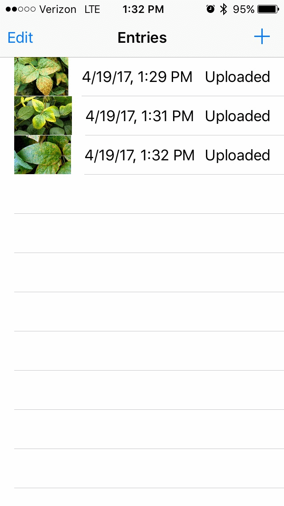

# Soybean-tracker
iOS app allowing soybean farmers to submit data about diseased crops to a centralized system for analysis. Designed for use by the Computational Physics and Mechanics Laboratory at Iowa State University.

